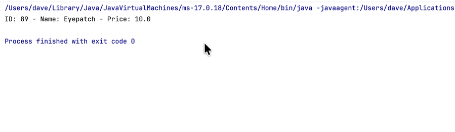

# My Freestyle Class Code

## Some screen-shots
### Subheading
1. 1️⃣ first thing
2. second thing

* first bullet
* second bullet

This is a sentence.  
So is this.



Here's a single code snippet `userInput` using single ticks.  

Here's a method that cleverly uses another method:
```java
    private static HashMap<String, Product> loadInventoryMap(String fileName) {
        HashMap<String, Product> productNameMap = new HashMap<>();
        ArrayList<Product> arrayList = loadInventory(fileName);

        for (Product p : arrayList) {
            String productName = p.getName();

            productNameMap.put(productName, p);
        }
        return productNameMap;
    }
```

Okay... it wasn't _that_ clever.  But it was **bold**.

